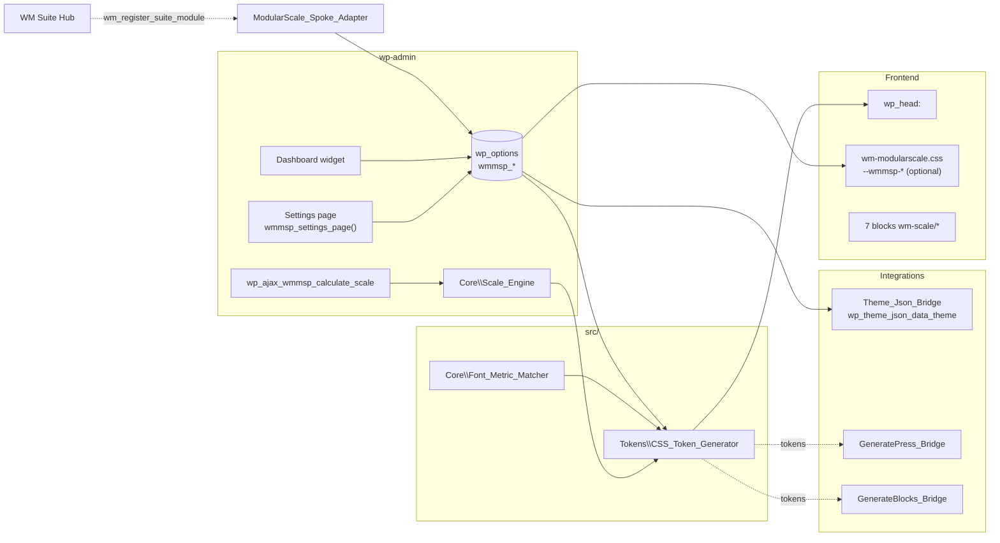

# Architecture — WM Modular Scale

Measured against the code on 2026-09-14. (This file was an Astro/Vite project template until then.)

## Runtime



## Responsibilities

| Layer | Owner | Notes |
| --- | --- | --- |
| Math | `Scale_Engine` | steps, clamp slope/intercept, line heights, APCA |
| CSS text | `CSS_Token_Generator`, `Font_Metric_Matcher` | pure functions, tested standalone |
| Delivery | `Plugin` (`wp_head`, inline style), `wmmsp_force_styles()` (legacy sheet) | both gated by `wmmsp_apply_typography` |
| Editor | `Block_Manager` + `block.json` + `render.php` | server-rendered blocks, category `wm-scale` |
| Theme bridges | `Theme_Json_Bridge`, `GeneratePress_Bridge`, `GenerateBlocks_Bridge` | filters only, no persistence |
| Admin | main file + `Settings_Controller` | family sheets from `assets/css/`, sandbox script from `assets/js/` |
| Hub | `includes/class-modularscale-spoke-adapter.php` | SBOM, telemetry, actions |

## Persistence

Ten `wmmsp_*` options (see DEVELOPERS.md §2). No custom tables, no transients, no post meta. `uninstall.php` deletes the options.

## Fragile spots

- The settings group must hold only fields the page posts: `options.php` writes null for every option of the group the form does not carry (it zeroed the viewports on every save until 2026-09-15). `Plugin::scale_options()` is the reader that tolerates unusable stored values; read the scale through it, not with `get_option()`.
- `wmmsp_apply_typography` defaults to 1 for the tokens and 0 for the legacy sheet.
- The sandbox math in `assets/js/modularscale-admin.js` mirrors `wmmsp_force_styles()` (base × ratio^n, same variable names, pinned by `tests/sandbox.test.ts` and test 14); the fluid tokens use `Scale_Engine::derive_clamp()` with min/max base sizes. Two formulas, one settings page.
- Every `render.php` must keep its `ABSPATH` guard inside PHP; a guard after the closing tag prints into the page (`tests/test-suite.php` checks all seven).

## Gates

`php tests/test-suite.php` (98) · `php tests/test-ui-family.php` (6) · `bash tests/run-mutations.sh` (25) · `tests/test-settings-save-runtime.php` on a local WordPress install (2, read-only) · `npm test` (vitest, 8) · Plugin Check on the distribution view (0 errors on 2026-09-14) · activation and smoke on a local WordPress install.

---

<!-- wm-measured-inventory -->

## Measured inventory

Regenerated from the code, never hand-edited. Everything above this line is written by hand and stays.

```bash
python3 the fleet's architecture inventory tool wm-modularscale --append-to docs/ARCHITECTURE.md
```

## Inventory by layer

**19 PHP files, 2283 lines** (excluding `tests/`, `vendor/`, `node_modules/`, `languages/`).

| Layer | Files | Lines |
|---|---:|---:|
| `(raíz)` | 2 | 466 |
| `includes` | 1 | 130 |
| `src` | 1 | 170 |
| `src/Admin` | 1 | 174 |
| `src/Core` | 2 | 435 |
| `src/Gutenberg` | 8 | 411 |
| `src/Integration` | 3 | 317 |
| `src/Tokens` | 1 | 180 |

---

## Classes

| Class | File |
|---|---|
| `Block_Manager` | [`src/Gutenberg/Block_Manager.php`](../src/Gutenberg/Block_Manager.php) |
| `CSS_Token_Generator` | [`src/Tokens/CSS_Token_Generator.php`](../src/Tokens/CSS_Token_Generator.php) |
| `Font_Metric_Matcher` | [`src/Core/Font_Metric_Matcher.php`](../src/Core/Font_Metric_Matcher.php) |
| `GenerateBlocks_Bridge` | [`src/Integration/GenerateBlocks_Bridge.php`](../src/Integration/GenerateBlocks_Bridge.php) |
| `GeneratePress_Bridge` | [`src/Integration/GeneratePress_Bridge.php`](../src/Integration/GeneratePress_Bridge.php) |
| `ModularScale_Spoke_Adapter` | [`includes/class-modularscale-spoke-adapter.php`](../includes/class-modularscale-spoke-adapter.php) |
| `Plugin` | [`src/Plugin.php`](../src/Plugin.php) |
| `Scale_Engine` | [`src/Core/Scale_Engine.php`](../src/Core/Scale_Engine.php) |
| `Settings_Controller` | [`src/Admin/Settings_Controller.php`](../src/Admin/Settings_Controller.php) |
| `Theme_Json_Bridge` | [`src/Integration/Theme_Json_Bridge.php`](../src/Integration/Theme_Json_Bridge.php) |

---

## Entry points

**Gutenberg blocks:** `wm-scale/contrast-matrix-badge`, `wm-scale/fluid-container`, `wm-scale/fluid-heading`, `wm-scale/fluid-lead`, `wm-scale/ratio-visualizer`, `wm-scale/theme-json-exporter`, `wm-scale/typographic-grid`

**AJAX actions:** `wmmsp_calculate_scale`

---

## Persistence — who writes each key and who reads it

| Key | Written by | Read by |
|---|---|---|
| `wmmsp_apply_typography` | `src/Admin/Settings_Controller.php` | `includes/class-modularscale-spoke-adapter.php`, `src/Plugin.php`, `wm-modularscale.php` |
| `wmmsp_base_size` | `src/Admin/Settings_Controller.php` | `includes/class-modularscale-spoke-adapter.php`, `wm-modularscale.php` |
| `wmmsp_base_size_max` | `src/Admin/Settings_Controller.php` | — |
| `wmmsp_font_override_preset` | `src/Admin/Settings_Controller.php` | `src/Plugin.php` |
| `wmmsp_max_viewport` | `src/Admin/Settings_Controller.php` | — |
| `wmmsp_min_viewport` | `src/Admin/Settings_Controller.php` | — |
| `wmmsp_precision` | `src/Admin/Settings_Controller.php` | `includes/class-modularscale-spoke-adapter.php`, `wm-modularscale.php` |
| `wmmsp_ratio` | `src/Admin/Settings_Controller.php` | `includes/class-modularscale-spoke-adapter.php`, `wm-modularscale.php` |
| `wmmsp_ratio_name` | `src/Admin/Settings_Controller.php` | — |
| `wmmsp_unit` | `src/Admin/Settings_Controller.php` | `includes/class-modularscale-spoke-adapter.php`, `wm-modularscale.php` |

**Written but never read:** `wmmsp_base_size_max`, `wmmsp_max_viewport`, `wmmsp_min_viewport`, `wmmsp_ratio_name`. Dead state: changing it has no effect.


---

## Gates

- `tests/mutations.php`
- `tests/run-mutations.sh`
- `tests/sandbox.test.ts`
- `tests/scale-engine.test.ts`
- `tests/setup.ts`
- `tests/test-modularscale.php`
- `tests/test-settings-save-runtime.php`
- `tests/test-suite.php`
- `tests/test-ui-family.php`
- `.github/workflows/ci.yml`

What CI actually runs is in the workflow files above — a test file that no workflow invokes is not a gate.

---

## Drift detected against the documentation

Nothing measurable: versions agree and every class named in the documents exists.

