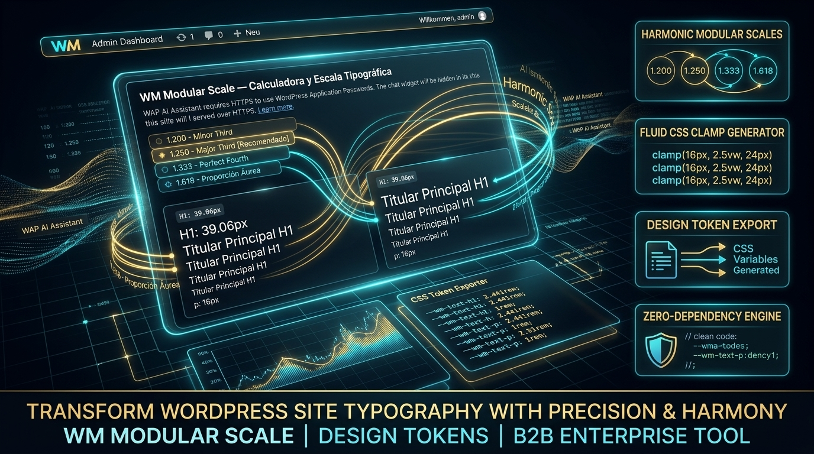

# WM Modular Scale (Slovenčina)

  [🇧🇬 Български](README.bg.md) • [🇨🇿 Čeština](README.cs.md) • [🇩🇰 Dansk](README.da.md) • [🇩🇪 Deutsch](../../README.de.md) • [🇬🇷 Ελληνικά](README.el.md) • [🇬🇧 English](../../README.md) • [🇪🇸 Español](../../README.es.md) • [🇪🇪 Eesti](README.et.md) • [🇫🇮 Suomi](README.fi.md) • [🇫🇷 Français](README.fr.md) • [🇮🇪 Gaeilge](README.ga.md) • [🇭🇷 Hrvatski](README.hr.md) [🇭🇺 Magyar](README.hu.md) • [🇮🇹 Italiano](README.it.md) • [🇱🇹 Lietuvių](README.lt.md) • [🇱🇻 Latviešu](README.lv.md) • [🇲🇹 Malti](README.mt.md) • [🇳🇱 Nederlands](README.nl.md) • [🇵🇱 Polski](README.pl.md) • [🇵🇹 Português](README.pt.md) • [🇷🇴 Română](README.ro.md) • [🇸🇰 Slovenčina](README.sk.md) • [🇸🇮 Slovenščina](README.sl.md) • [🇸🇪 Svenska](README.sv.md)

---

  
  
  
  
  

> **Typographic scale calculator, fluid `clamp()` token generator and Gutenberg / GeneratePress / GenerateBlocks typography bridge for WordPress**  
> **Autor a hlavný architekt:** Arnold Wender ([ORCID: 0009-0005-1750-818X](https://orcid.org/0009-0005-1750-818X)) · Inhaber, Wender Media (Einzelunternehmen) · Halle (Saale), Germany · 2026  
> **Oficiálna webová stránka:** [https://www.wendermedia.com](https://www.wendermedia.com) · **Personal Website:** [https://www.arnoldwender.com](https://www.arnoldwender.com) · **SEO Portal:** [https://www.seo-halle.de](https://www.seo-halle.de) · **Cognitive Substrate:** [https://neurozoa.ai](https://neurozoa.ai)

---

## 🧠 Intelligence Architecture & Cognitive Substrate

`wm-modularscale` is engineered by **Arnold Wender** through **Wender Media's** autonomous agentic workflow architecture, augmented by his proprietary neuroplastic cognitive substrate, [Neurozoa](https://neurozoa.ai) (developed by Arnold Wender), for continuous telemetry analysis, pattern reasoning, and architectural recommendations.

---

## 📸 Slovenčina Enterprise Showcase

---

## 🟢 ÚROVEŇ 1: STRUČNÝ PRAPODROBNÝ SPRIEVODCA PRE ZAČIATOČNÍKOV (NO-CODE)

### Čo tento plugin robí pre vašu webovú stránku?
Typographic scale calculator, fluid `clamp()` token generator and Gutenberg / GeneratePress / GenerateBlocks typography bridge for WordPress

### 🚀 Ako začať za 2 minúty (Krok za krokom):
1. Install and activate the plugin (WordPress 6.4+, PHP 8.1+).
2. Open **Modular Scale** in the admin menu (**Wender Media › Modular Scale** with the hub).
3. Pick a ratio preset or type one, set base size, unit and precision, watch the sandbox, tick *Skala auf der Website anwenden* (the admin screens are German), save.
4. In the editor, use the *WM Modular Scale* block category or the `.has-fluid-*` classes; with GeneratePress / GenerateBlocks the tokens appear in their own controls.

### 💡 Často kladené otázky pre začiatočníkov:
#### ❓ What is not included?
No WP-CLI commands, no REST endpoints, no shortcodes, no custom database tables, no audit log or export, no external requests.

---

## 🟡 ÚROVEŇ 2: PRÍRUČKA PRE WEBMASTERI A ADMINISTRÁTOROV

### What the plugin does
1. **Calculates a modular scale.** One base size, one ratio (Major Second 1.125 … Golden Ratio 1.618, or a custom value), nine steps from −2 (micro caption) to +6 (hero) — `WenderMedia\ModularScale\Core\Scale_Engine`.
2. **Prints fluid CSS tokens into `<head>`** when *apply to the site* is on: `@property` declarations and a `:root` block with `--wm-step-neg-2 … --wm-step-6` as `clamp(min, preferred, max)` between the configured viewports (default 360 px → 1440 px), matching `--wm-lh-*` line heights, semantic aliases (`--wm-font-size-h1 … body`) and GeneratePress aliases (`--gp-font-size-*`), plus the utility classes `.has-fluid-h1-font-size … .has-fluid-body-font-size` and `.wm-fluid-container` (container queries). Each step is checked against WCAG 1.4.4 zoom safety (max ≤ 2.5 × min). Optional anti-CLS `@font-face` fallback override (Inter → Arial, Roboto → Arial, Merriweather → Georgia, Playfair → Times).
3. **Optional legacy sheet.** The settings page's *apply* toggle also enqueues `wm-modularscale.css`, which sizes `body`, `h1`–`h6`, `p`/lists from `--wmmsp-*` variables computed from base, ratio, unit and precision. No viewport rule shrinks the configured base size (default 16 px); the plugin does not enforce a minimum, the field accepts any value from 1.
4. **Seven Gutenberg blocks** in the "WM Modular Scale" category (`wm-scale/*`): Fluid Heading, Fluid Lead Text, Fluid Container (`@container`), Typographic Grid (CSS grid with a scale gap), Ratio Visualizer (the nine steps drawn at their sizes), APCA Contrast Badge (Lc of a colour pair per apca-w3 0.1.9 with the usage hint of APCA's readability criterion; APCA is not part of WCAG), Theme.json Exporter.
5. **theme.json bridge.** Filters `wp_theme_json_data_theme`: `settings.typography.fontSizes` become the nine fluid steps (`wm-step-neg-2 … wm-step-6`), `defaultFontSizes: false`, `fluid: true`.
6. **GeneratePress bridge.** Empties the Google Fonts list and hides it in the Font Manager, dequeues `generate-fonts`, appends `--gp-font-size-*` plus `h1`–`h6` rules to GeneratePress' dynamic typography CSS, and lists Inter, Outfit, Cinzel, Cabinet Grotesk and a system stack in the font pickers (the plugin ships no font files; those names resolve only if the site provides them).
7. **GenerateBlocks bridge.** Global styles `wm-fluid-h1/h2/h3/body`, typography presets `wm-step-0 … 6`, and `container-type: inline-size` on a Container block that carries the `useContainerQueries` attribute.
8. **Admin.** Settings page (menu *Modular Scale*, or under *Wender Media* when the hub is active; also *Settings › Modular Scale*) with a live sandbox preview and one-click ratio presets; a dashboard widget with the configured base, ratio and apply state. Both render from the Wender Media admin family sheets.
9. **WM Suite Hub spoke.** `includes/class-modularscale-spoke-adapter.php` registers through `wm_register_suite_module`: SBOM entry with the SHA-256 of the main file, telemetry (base size, ratio, applied, H1–H3 tokens) and the `self_test` / `calculate_scale` actions.

### Not shipped
No WP-CLI commands, no REST endpoints, no shortcodes, no custom database tables, no audit log or export, no external requests.

---

## 🔴 ÚROVEŇ 3: PRÍRUČKA PRE VÝVOJÁROV A SOFTVÉROVÝCH ARCHITEKTOV

Classes, hooks, options, the admin screen and the WM Suite Hub adapter are documented in the English manual: **[DEVELOPERS.md](../../DEVELOPERS.md)**.

---

## ⚖️ Európska legislatíva a súlad

- **Zero external requests:** no CDN, no Google Fonts (the GeneratePress bridge removes them), no telemetry to third parties.
- **Accessibility:** the configured base size (default 16 px) holds on every viewport, every fluid step is checked against WCAG 1.4.4 zoom (max ≤ 2.5 × min), the APCA badge shows the Lc of a colour pair. No conformity with WCAG or the BFSG is claimed.
- **Privacy:** no personal data is processed; the plugin reads and writes its own options only.

---

## 🔒 Licencia a vlastnícke práva

Distributed under the **GNU General Public License v2 or later (Enterprise Edition)**.  
Copyright (C) 2026 Arnold Wender / Wender Media. All rights reserved.  
Website: [https://www.wendermedia.com](https://www.wendermedia.com) · Cognitive Substrate: [https://neurozoa.ai](https://neurozoa.ai)
